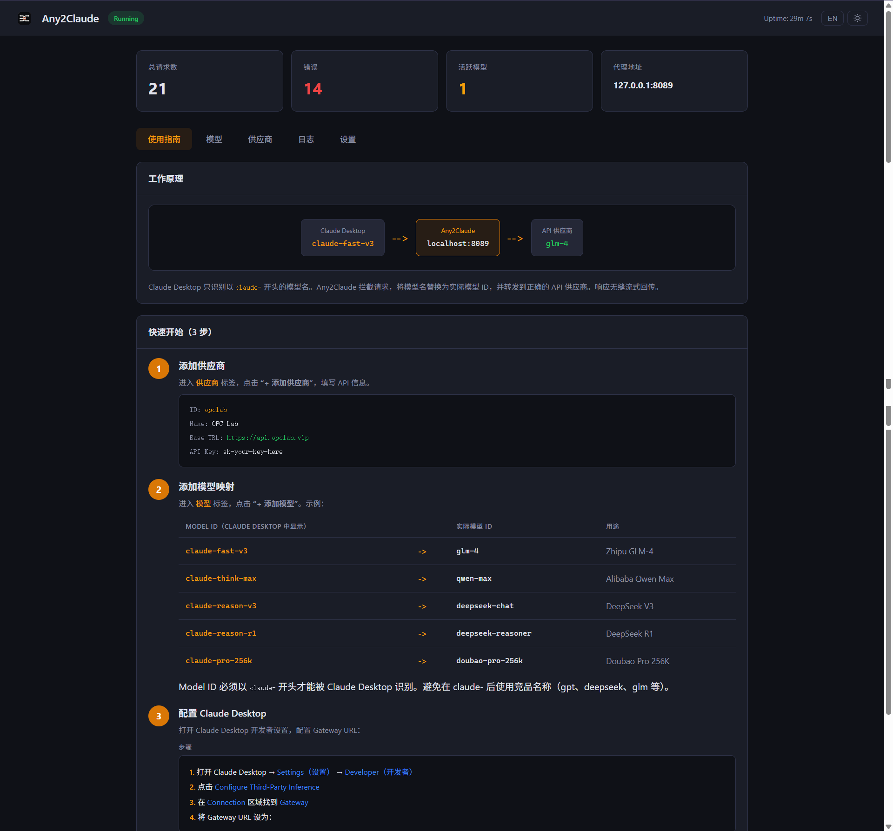

# Any2Claude User Guide

> Complete flow from install to usage.

---

## Quick Start

### 1. Launch

**Windows:** Double-click `Any2Claude.exe`. Tray icon appears, right-click to open Dashboard.

**macOS / Linux:** Run `./Any2Claude` in terminal, open `http://127.0.0.1:8090`.

### 2. Dashboard

The management panel:

<!-- Screenshot: Full Dashboard page, Guide tab, showing stat cards + How It Works diagram + Quick Start steps -->

5 tabs: **Guide** / **Models** / **Providers** / **Logs** / **Settings**

### 3. Setup

1. **Providers tab** → `+ Add Provider` → enter API URL and Key → Save
2. **Models tab** → `+ Add Model` → enter Model ID (starts with `claude-`) and real model name → Save
3. **Claude Desktop** → Settings → Developer → Configure Third-Party Inference → Gateway: `http://127.0.0.1:8089` → Restart

Your mapped models will appear in Claude Desktop's model selector.

### 4. Troubleshooting

Enable Debug Mode in **Settings tab**, then check **Logs tab** for detailed request/response info.

---

Full documentation: [README.md](../README.md) | [README_CN.md](../README_CN.md)
